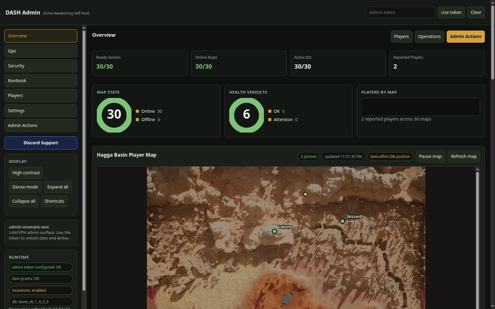
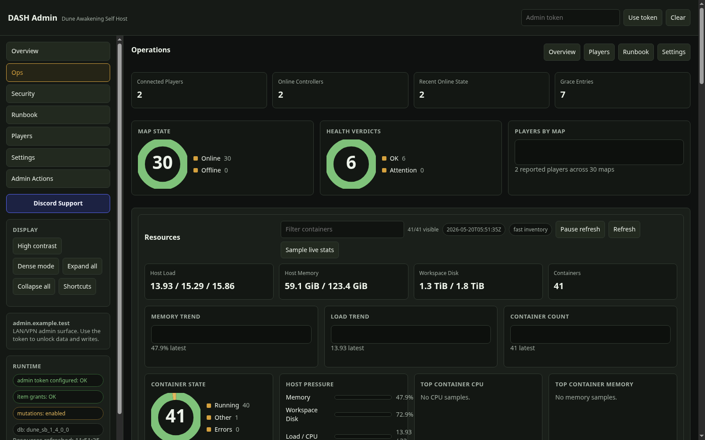

# DuneAwakeningSelfHost (DASH)

DASH is a Linux/Docker Compose operations harness for the official Steam-installed **Dune: Awakening Self-Hosted Server** package.

Support DASH development through [PayPal](https://www.paypal.com/donate/?business=donations%40snape.tech) or [Ko-fi](https://ko-fi.com/snapetech).

It turns Funcom's self-host stack into a reproducible local layout with Compose services, startup and recovery scripts, a LAN/VPN admin panel, backup tooling, optional Postgres replication, warm-pool map startup, restart automation, player/admin utilities, and a public static site package that does not expose private control surfaces.

This repository does **not** contain, mirror, or license Funcom server binaries, container images, Steam package files, game assets, live server data, or secrets.

Always compare your `.env` image pin with the Steam package installed on your host.

## Contents

- [Screenshots](#screenshots)
- [Choose Your Path](#choose-your-path)
- [What DASH Includes](#what-dash-includes)
- [What DASH Does Not Include](#what-dash-does-not-include)
- [Security Posture](#security-posture)
- [Requirements](#requirements)
- [Quick Start](#quick-start)
- [Install And Deployment Paths](#install-and-deployment-paths)
- [Admin Panel](#admin-panel)
- [Operations And Recovery](#operations-and-recovery)
- [Backups, Replication, And Restore](#backups-replication-and-restore)
- [Networking And Ports](#networking-and-ports)
- [Automation And Host Services](#automation-and-host-services)
- [Public Static Site](#public-static-site)
- [Artificial Exchange](#artificial-exchange)
- [Ecosystem Feature Parity](#ecosystem-feature-parity)
- [Configuration Map](#configuration-map)
- [Validation Before Publishing](#validation-before-publishing)
- [Full Manual](#full-manual)
- [Key Files](#key-files)

## Screenshots

### Overview



### Operations



## Choose Your Path

| Goal | Start here | Public exposure |
| --- | --- | --- |
| Single-map validation | Prove Steam package, token, database bootstrap, Gateway, RabbitMQ, and `Survival_1`. | `7777/udp` plus `31982/tcp` for live-client login. |
| Public self-host | Run minimum-footprint, balanced adaptive, or full-warm map policy after single-map validation passes. | Game UDP range for your layout plus `31982/tcp`. |
| Full warm-pool operator setup | Run all 30 official self-host partitions, watchdog recovery, restart planning, backups, and optional replica/sync. | `7777-7810/udp`, optional observed IGW `7888-7918/udp`, plus `31982/tcp`. |
| Public-status-only website | Render static status, settings, players, and Hagga Basin map files from the private DASH host. | Only your normal static web server ports. |

## What DASH Includes

- Compose topology for Postgres, admin RabbitMQ, game RabbitMQ, auth shim, text router, Gateway, Director, map services, and the admin panel.
- Minimal single-map startup for `Survival_1`.
- Expanded nine-map standing farm matching the current travel targets used by the Compose layout.
- Configurable 30-partition lifecycle through `compose.allmaps.yaml` and `scripts/start-full-warm-pool.sh`: minimum footprint, balanced adaptive retention, full warm, or custom per-map policy.
- Guarded additional `Survival_1` Sietch dimensions (up to 64 total), with
  per-partition display/password settings, isolated saved-data volumes,
  topology reconciliation, and all-farm lifecycle integration.
- Recovery helpers for dependency loss and stale fixed-partition server IDs.
- Host-level map watchdog service for unattended recovery.
- LAN/VPN admin panel with Overview, Ops, Infrastructure, World, Security, Runbook, Players, Cosmetics, Blueprints, Care Packages, Addons, Bootstrap, Settings, Admin Actions, Admin Digests, Catalog, and Discovery surfaces.
- Browser service/log control, verified manual and automatic backup lifecycle, daily no-network PostgreSQL restore proof with hash-chained RPO/RTO receipts, time-weighted SLOs/error budgets and immutable incident history, HMAC-sealed file/container desired-state attestation, tamper-evident operational change intelligence with non-causal incident correlation, deterministic evidence-linked response plans, portable signed escalation capsules, layered disaster restore, bounded database query/row/password controls, dynamic map autoscaling, retained capacity intelligence with evidence-driven adaptive retention, live memory balancing, and retained Prometheus metrics.
- Staged game-build acquisition and exact candidate-bound update certification
  with recovery/configuration/health gates, expiring HMAC receipts, candidate
  drift invalidation, fail-closed browser apply enforcement, and constant-I/O
  Docker manifest inspection that skips multi-gigabyte image layers.
- Cache-aware, host-local CPU-affinity generation with guarded no-restart live application, Compose persistence, and rollback.
- Backup-first Linux sysctl/THP/NIC-ring/IRQ tuning that preserves larger existing network maxima and never restarts Docker.
- Live inventory slot-integrity audit plus hostname-, backup-, capacity-, and transaction-gated no-delete conflict repair.
- Guarded admin writes for currency, Solari, XP, skills, water, kick/kick-all, vehicle spawn/repair/refuel, Landsraad rewards/contributions, blueprints, augments, items, offline transaction-verified stack/quality edits, care packages, and catalog workflows.
- Searchable character cosmetics/skins with an independently observed 391-ID catalog, optional local-pak catalog generation, exact catalog-confined add/remove, customization-only bulk unlock, Offline row locking, automatic database backups, compare-and-swap verification, private receipts, and guarded rollback.
- Permissioned Discord adapter routes: read/ops remain role-scoped, community writes are identity-bound and narrowly typed, and generic admin/broadcast writes remain blocked; community UI addons use a SHA-pinned permission-review lifecycle.
- First-party dependency-free Discord Gateway bot with seven groups and 37 guild-scoped `/dune` subcommands, channel restrictions, ephemeral responses, role propagation, and a hardened credential-waiting systemd service.
- Named hashed-token admin identities with explicit route capabilities and the original owner token retained as a recovery credential.
- Signed, filtered outbound audit-event delivery for generic HTTPS receivers and Discord webhooks, with asynchronous bounded retries, recursive redaction, redirect refusal, and secret-free delivery records.
- An isolated community-credit economy with one-time Discord account linking, immutable hash-chained ledger, atomic shop/kit stock and orders, playtime/vote/manual-payment accrual, movement-verified scaled session airdrops, daily streaks, weekly active-time thresholds, append-only engagement claims, versioned reward tracks, offline delivery receipts, and failure refunds.
- Persistent one-time/recurring event automation with safe announcement and non-executing restart-plan primitives, dry-run mutation proposals, manual run/cancel, and a bounded execution ledger.
- Reproducible backend item-grant helper with dry-run, explicit confirmation, and reviewed display-name labels such as `Complex Machinery` -> `T2MachineComponent`.
- Restart announcements, restart planner hooks, chat-command bridge, player-presence announcer, and admin-bot monitoring.
- Private whisper replies for admin chat commands, auction confirmations, player-presence messages, and admin-only digests through the verified `chat.whispers` route.
- Chat spam protection with repeat-message detection, public action announcements, and a blocked-by-default kick backend.
- Verified targeted network-timeout teleport research: a scoped `UNetConnection` timeout plus the shipped offline move helper moved a test player, and reconnect loaded the moved pawn. This is a working teleport mechanism, not a soft disconnect; see `docs/soft-disconnect-teleport.md`.
- Player-presence automation for first-time welcomes, returning-player welcome-backs, leaves, first-seen private messages, Hagga/Deep Desert milestones, base-cap reminders, reconnect help, restart warnings, map-health notices, population digests, incident notices, starter Base Reconstruction Tool grants, and Vermilius Gap celebration.
- Local backups, hardened disposable restore drills, restore helpers, optional streaming Postgres replica, optional remote replica snapshots, and portable offsite/onsite backup sync examples.
- Optional public static site package with status, settings, player list, and Hagga Basin map.
- Artificial Exchange as a first-class economy feature: reviewed price catalog, artificial buyer, validated seller settlement, optional buyer funding, controlled seeded listings, readiness checks, smoke tests, admin-panel controls, optional systemd services, and watchdog timer.
- Publication and validation guardrails for keeping local state and secrets out of shared artifacts.
- Receipt-bound, transactional deployment for reviewed Windows client loader,
  Lua, and additive Pak artifacts, with confined paths, build/source/target
  checksums, fail-closed manifests, installed-file/backup verification, and
  retryable drift-safe rollback plus a whole-state audit; the verified Windows
  archive includes the manager, runbook, current canary evidence, and test
  receipts.
- Immutable commit/SHA-256 release installation with atomic activation,
  persistent state, no-restart rollback, and malicious-archive preflight;
  clean-host Ansible, secret-free cloud-init, token-authenticated Proxmox,
  constrained Pelican/Pterodactyl remote control, and fenced active/passive VIP
  packaging.
- Strict remote SSH profiles with loopback tunnels and verified two-phase key
  rotation; privacy-bounded on-demand conntrack peer diagnostics; and a
  searchable, binary-hash-bound 7,028-entry console catalogue alongside the
  2,242-key shipped INI index.
- Transactional client loader, sidecar, Lua runtime, and confined Pak-overlay
  deployment with non-mutating plans, shipping-executable checksums,
  pre-change backups, private manifests, atomic installation, verification,
  collision detection, and drift-safe rollback. Direct Steam mutation remains
  an explicitly authorized canary step.

## Ecosystem Feature Parity

DASH maintains an evidence-backed aggregate comparison against the credible
Dune: Awakening self-hosting, dashboard, deployment, administration, economy,
community, and modding-tool ecosystem. The current catalogue covers the
official Funcom baseline, AMP, Red-Blink, Arrakis Command Nexus, dune-admin,
AlphaNine Dune Suite, Sietch Console, Easy Dune Admin, Dune Dedicated Server
Manager, DST, the active community dashboards, Linux/KVM/Proxmox/Pelican
deployment projects, Discord/economy/airdrop tools, Wormageddon, and the base
designer/gallery.

The earlier Red-Blink-specific tranche and the feasible aggregate ecosystem
parity build are complete for the pinned audit snapshot. Guarded inventory
repair, multi-user local RBAC, host/CPU tuning, signed outbound events,
recurring event execution, the first-party Discord bot, community rewards/shop,
OIDC/Discord federated login, base creator, encrypted backup archives, bounded
diagnostics, gameplay presets, guarded cosmetics administration, recoverable
base retirement, and alternate
deployment packaging are implemented. Discord and federated login still need
operator application credentials for external canaries. Client loader/Pak
deployment remains separately authorization-gated, and self-host voice remains
blocked on the proprietary Funcom-compatible Tencent GME contract rather than
a missing peer implementation.

Beyond the pinned peers, DASH also retains map-hours saved, idle warm cost,
warm/cold revisit outcomes, demand-to-ready cold-start distributions,
observation coverage, and per-map retention recommendations. The adaptive mode
can apply only evidence-qualified recommendations, moves gradually, preserves
map modes and pressure budgets, and writes tamper-evident receipts.

DASH also continuously compares the repository's operational configuration and
Compose runtime with an operator-reviewed, HMAC-sealed desired state. It keeps
immutable baseline history, retained drift ownership/resolution, signed
observations, a chained audit ledger, private metrics, SLO integration, and
backup-bound key verification without exporting file contents or runtime
secrets.

Its Change Intelligence timeline goes another step beyond peer dashboards: it
HMAC-chains redacted operator/system events and ranks temporally correlated
changes when an SLO incident or desired-state finding opens. Evidence capsules
include preceding changes and bounded response history while explicitly
refusing to present correlation as proof of root cause. Every capsule now also
compiles an immutable policy- and input-digested response plan for the exact SLO
or drift contract. Plans separate verified facts from operator work, link only
to bounded diagnostics and existing guarded recovery surfaces, execute nothing
automatically, and remain verifiable inside portable signed escalation
artifacts and matching-key backups.
Operators can rehearse a plan without disruption: DASH runs only fixed
read-only diagnostics, validates current recovery capabilities and gates,
discards diagnostic output after hashing it, executes no recovery, and appends
the readiness receipt to the incident's HMAC evidence chain.
They can also certify the complete response policy in one action. Shared
diagnostics run once, every runbook and guarded recovery contract is scored,
exact capability/gate/confirmation gaps are displayed, and the global
tamper-evident receipt becomes part of every subsequent signed incident capsule.

DASH now closes the deployment loop as well. An assured change window binds an
exact commit and staged file manifest to verified pre/post backups, a private
source rollback archive, every game-map container identity/start time, desired
state, 12/12 response readiness, converged SLO/change health, and Prometheus
evidence. It deploys
only the control plane through the normal tested path, fails on any unplanned
map recreation/restart or stale health proof, and emits a semantically verified
HMAC receipt that the final backup must contain.
Finalization requires multiple consecutive healthy collector samples, so an
admin restart cannot turn a transient stale sample into a failed receipt.

Game-build upgrades now have their own candidate-bound safety gate. DASH binds
the exact Steam build and Funcom image tag to a verified backup, isolated
restore proof, Compose/Coriolis/post-start hooks, desired state, SLO/change
integrity, fleet readiness, deployment assurance, and online-player state.
The signed receipt expires and invalidates on candidate drift; browser update
execution fails closed without a current receipt. Certification itself runs no
update, restart, or game mutation. Package identity reads at most the first and
last 16 MiB of each uncompressed Docker-save tar, validates the manifest header,
and seeks directly to bounded JSON instead of streaming image-layer payloads.

See [`docs/ecosystem-feature-parity-audit.md`](docs/ecosystem-feature-parity-audit.md)
for the pinned peer list, full capability matrix, confidence levels, exclusions,
and implementation order. See
[`docs/red-blink-feature-parity-audit.md`](docs/red-blink-feature-parity-audit.md)
for the completed source-level Red-Blink comparison.

## What DASH Does Not Include

- Funcom server binaries, container images, Steam package files, or game assets.
- A Funcom self-hosting/FLS token.
- Production hosting, DDoS protection, router/firewall configuration, or account portal access.
- Point-in-time recovery by replication alone. Replicas mirror bad writes and deletes too.
- Generic native GM/cheat commands outside the catalog-backed Version 2 player-action contract. Skill, water, kick/kick-all, and vehicle spawn use the pinned game-notification path documented in `docs/player-runtime-actions.md`; unrelated legacy RPC candidates remain preview-only.
- Public exposure for Postgres, RabbitMQ management, the admin panel, debug ports, or private automation endpoints.

## Security Posture

Keep these local and uncommitted:

- `.env`
- `data/`
- `backups/`
- `captures/`
- `config/tls/`
- Steam package contents and Funcom image tarballs
- TLS material, logs, dumps, routing traces, database exports, tokens, passwords, public IPs, real hostnames, and private admin/community details

The admin panel is intended for trusted LAN/VPN access only. Do not expose it directly to the public internet. Public exposure should be limited to required gameplay ports, the game RabbitMQ client TCP endpoint, and optionally a separate static website generated from sanitized files.

Admin mutations are gated and audit-logged. Many higher-risk paths are dry-run-first or disabled unless explicit `.env` gates are enabled. GM, cheat, native command, and unverified live-action surfaces stay blocked by default.

Replication is a redundancy layer, not a backup strategy. Keep stopped-world backups and test restores because logical mistakes, destructive admin writes, and compromised credentials can replicate immediately.

Read [`SECURITY.md`](SECURITY.md) and [`docs/publication.md`](docs/publication.md) before sharing the repo or publishing artifacts.

## Requirements

- Linux host with Docker Compose.
- Official **Dune: Awakening Self-Hosted Server** Steam tool installed locally.
- Valid self-hosting/FLS token from Funcom's live account portal: `https://account.duneawakening.com/`.
- CPU with AVX2 support.
- Memory and disk sized for the map count you intend to run.
- `openssl`, `jq`, `rg`, Python 3, and standard shell tooling for helper scripts.

## Quick Start

Generate local settings, edit `.env`, validate the host, load the official Steam package images, and initialize the database:

```bash
./scripts/populate-local-env.sh
$EDITOR .env
make operational-identity-check ENV_FILE=.env
make operational-report ENV_FILE=.env
make operational-bundle ENV_FILE=.env
make verify-operational-bundle BUNDLE_FILE=backups/<operational-bundle>.tgz
./scripts/preflight.sh
./scripts/load-images.sh .env
docker compose --env-file .env up -d postgres admin-rmq game-rmq
docker compose --env-file .env run --rm db-init
```

For a one-server test world, prune unused generated `Survival_1` dimensions after database bootstrap:

```bash
./scripts/single-survival-partition.sh .env
```

Start the service layer:

```bash
docker compose --env-file .env up -d rmq-auth-shim text-router gateway director
./scripts/status.sh .env
```

Start a single test map:

```bash
docker compose --env-file .env up -d survival
./scripts/status.sh .env
```

Start the private admin panel:

```bash
docker compose --env-file .env up -d admin-panel
```

Default local URL:

```text
http://127.0.0.1:18080/
```

More detail: [`docs/setup.md`](docs/setup.md).

## Install And Deployment Paths

### Immutable Clean-Host Release

For repeatable hosts, install an exact source archive without starting or
restarting the farm:

```bash
sudo ./scripts/install-release.sh install \
  --ref <full-40-hex-commit> \
  --sha256 <exact-64-hex-archive-sha256> \
  --activate
```

State and operator config remain under `/var/lib/dash`; releases live under
`/opt/dash/releases`. Ansible, Proxmox, cloud-init, Pelican/Pterodactyl, and
fenced active/passive deployment packages live under `packaging/`. See
[`docs/deployment-packaging.md`](docs/deployment-packaging.md) before using any
automated path.

### Minimal Single-Map Test

Use this first on a new host. It proves the Steam package, `.env`, database initialization, Gateway/Director service layer, RabbitMQ auth path, and starting map registration.

```bash
./scripts/populate-local-env.sh
./scripts/preflight.sh
./scripts/load-images.sh .env
docker compose --env-file .env up -d postgres admin-rmq game-rmq
docker compose --env-file .env run --rm db-init
./scripts/single-survival-partition.sh .env
docker compose --env-file .env up -d rmq-auth-shim text-router gateway director survival
./scripts/status.sh .env
```

### Expanded Nine-Map Standing Farm

This keeps one container online for each current travel target in the base Compose layout.

```bash
./scripts/full-world-partitions.sh .env

docker compose --env-file .env up -d \
  survival overmap arrakeen harko-village \
  testing-hephaestus testing-carthag testing-waterfat \
  deep-desert proces-verbal

./scripts/status.sh .env
```

Expected server-side readiness:

```text
current_alive_active=9 active_servers=9 partitions=9
```

### Adaptive Or Full 30-Partition Map Pool

The all-maps overlay defines every official single-dimension partition. The
startup helper honors the persisted autoscaler policy: minimum and balanced
start only core maps, while full warm starts every map. Director demand starts
dynamic maps later through the guarded fast path.

```bash
./scripts/start-full-warm-pool.sh .env
COMPOSE_FILES='compose.yaml:compose.allmaps.yaml' ./scripts/rmq-health.sh .env
```

Expected server-side readiness:

```text
current_alive_active=30 active_servers=30 partitions=30
```

That 30/30 expectation applies to `full-warm`. The balanced baseline
keeps Survival and Overmap always on, retains recently used maps, caps optional
warm maps with LRU eviction, and evicts only empty/non-demanded dynamic maps
when available memory crosses the configured floor:

```env
DUNE_AUTOSCALER_ENABLED=true
DUNE_AUTOSCALER_PROFILE=balanced
DUNE_AUTOSCALER_DEFAULT_MODE=dynamic
DUNE_AUTOSCALER_ALWAYS_ON_SERVICES=survival,overmap
DUNE_AUTOSCALER_BALANCED_RETENTION_SECONDS=900
DUNE_AUTOSCALER_BALANCED_RETENTION_BY_SERVICE=arrakeen=2700,harko-village=2700,deep-desert=1800
DUNE_AUTOSCALER_BALANCED_MAX_WARM_MAPS=4
DUNE_AUTOSCALER_BALANCED_MIN_AVAILABLE_MEMORY_GIB=16
```

The Infrastructure page can switch between `minimum-footprint`, `balanced`,
`adaptive`, `full-warm`, and `custom`, and can edit per-map retention and global budgets.
For file-based installation, preview and apply a profile without touching
unrelated `.env` keys:

```bash
./scripts/configure-autoscaler-profile.sh .env balanced
./scripts/configure-autoscaler-profile.sh .env balanced --execute
```

See [`docs/autoscaling-memory.md`](docs/autoscaling-memory.md) for lifecycle,
reboot, migration, safety, and measured startup details.

Live-client login and travel still depend on a valid FLS token, public reachability, router/firewall state, and LAN reflection when joining from inside the same network. See [`docs/full-farm.md`](docs/full-farm.md), [`docs/operations.md`](docs/operations.md), and [`docs/lan-reflection.md`](docs/lan-reflection.md).

### Optional Host Services

Install only after the matching manual command works:

```bash
make install-map-watchdog-service ENV_FILE=.env
make install-full-farm-service ENV_FILE=.env
make install-daily-maintenance-timer ENV_FILE=.env
make install-player-presence-announcer-service ENV_FILE=.env
```

### Optional Postgres Replica

```bash
COMPOSE_FILES=compose.yaml:compose.replica.yaml ./scripts/setup-postgres-replica.sh .env
```

### Optional Backup Sync

```bash
DUNE_BACKUP_REMOTE_ENV=examples/backup/rclone-offsite.env ./scripts/backup-offsite.sh .env
DUNE_BACKUP_REMOTE_ENV=examples/backup/rsync-nas.env ./scripts/backup-offsite.sh .env
DUNE_BACKUP_REMOTE_ENV=examples/backup/restic.env ./scripts/backup-offsite.sh .env
```

### Optional Public Static Site

```bash
make public-site-check
./public-site/scripts/package-dune-public-site.sh /tmp/dash-public-site.tar.gz
```

## Admin Panel

Start:

```bash
docker compose --env-file .env up -d admin-panel
```

Open:

```text
http://127.0.0.1:${DUNE_ADMIN_HOST_PORT:-18080}/
```

If another process owns `18080`, set `DUNE_ADMIN_HOST_PORT=18081` in `.env`, include that host in `DUNE_ADMIN_ALLOWED_HOSTS`, and recreate only the admin panel.

The admin surface requires authentication by default. Set a high-entropy `DUNE_ADMIN_TOKEN`, enable named RBAC identities, or configure federated login; protected token requests send `X-Admin-Token`. An explicitly unlocked panel requires `DUNE_ADMIN_REQUIRE_TOKEN=false` and must remain confined to a trusted local boundary.

| Page | Purpose |
| --- | --- |
| Overview | Readiness metrics, health summary, Hagga Basin player map, map details, and player preview. |
| Ops | Restart planner, restart announcements, resource telemetry, map health, network checks, farm state, and partition state. |
| Infrastructure | Compose service/log control, manual/automatic backup lifecycle, isolated recovery proof and restore, reliability SLO/error-budget control room, database query/row/password tools, autoscaling, memory controls, candidate-bound game-update certification, and update/repair. |
| Backup Encryption | Verified recipient OpenPGP archives, ciphertext receipts, safe decrypt staging, encrypted-only rclone/rsync mode, and encrypted restic repositories. |
| World | Read-only guild/member, Landsraad term/task/reward/contribution, and aggregate storage views; Landsraad writes remain on Admin Actions. |
| Security | Host/origin checks, auth mode, mutation gates, allowlists, and audit events. |
| Federated Login | Provider-neutral OIDC or Discord OAuth code+PKCE login, explicit subject-to-local-RBAC mapping, signed HttpOnly sessions, logout, and owner-token recovery. |
| Runbook | Copy/paste operational commands for health, backups, restores, logs, profiling, and routing capture. |
| Command Console | Six reviewed native read-only diagnostics with no subprocess/shell/arguments, bounded timeout/output, redaction, operator RBAC, and receipt-only audit. |
| Players | Online/offline roster, player detail, account/controller/pawn context, currency, XP, inventory, and location views. |
| Moderation | Case workflow, enforced policy bans/unban, allowlist registry/policy, presence sessions, coarse heatmaps, normalized security signals, and enforcement receipts. |
| Base Creator | Read-only exact/recentered live-base export, snapping/yaw grid editor, reconstruction preview, JSON download, isolated visibility/rating gallery, and fingerprint-bound native retirement into Dune's recoverable base-backup system. |
| Gameplay Presets | Nine curated worm/threat/storm/harvest/day/hydration/world profiles with exact preview, fixed allowlists, backup-first atomic apply, confined rollback, Landsraad-cycle enforcement, and manual guarded restart handoff. |
| Blueprints | Validated Solido list/export/import/delete/deduplicate workflow with rollback archives. |
| Care Packages | Reviewed manual and automatic first-online/returning-player presets, persisted eligibility/claims, retry controls, backups, and history. |
| Addons | SHA-pinned discovery, permission review, staging, lifecycle, quarantine, sandbox, and constrained bridge. |
| Bootstrap | Required-setting status, preflight, TLS generation, database initialization, and stack reconcile. |
| Settings | Selected `.env` and config edits with backups. |
| Admin Actions | Guarded runtime skill/water/kick/vehicle actions, persistent vehicle maintenance, Landsraad writes, currency/Solari/XP, augments, grants, keystones, stack edits, and deletion. |
| Admin Digests | Private operator summaries derived from existing presence and operations state. |
| Catalog | Content insertion evidence, typed knob dry-runs/writes, resource and progression inspection, event planning, economy bundle planning, and gated world/player/economy mutator families. |

If the published local admin port accepts TCP but returns no HTTP bytes after a container recreate, refresh the observed Docker bridge neighbor entries:

```bash
./scripts/seed-gateway-neighbor.sh
curl -H 'Host: admin-panel:8080' http://127.0.0.1:${DUNE_ADMIN_HOST_PORT:-18080}/api/status
```

More detail: [`docs/admin-panel.md`](docs/admin-panel.md), [`docs/admin-access-control.md`](docs/admin-access-control.md), [`docs/federated-auth.md`](docs/federated-auth.md), [`docs/infrastructure-console.md`](docs/infrastructure-console.md), [`docs/restore-drills.md`](docs/restore-drills.md), [`docs/operational-slo.md`](docs/operational-slo.md), [`docs/backup-encryption.md`](docs/backup-encryption.md), [`docs/command-console.md`](docs/command-console.md), [`docs/world-console.md`](docs/world-console.md), [`docs/care-packages.md`](docs/care-packages.md), [`docs/community-rewards.md`](docs/community-rewards.md), [`docs/moderation-history.md`](docs/moderation-history.md), [`docs/base-creator.md`](docs/base-creator.md), [`docs/gameplay-presets.md`](docs/gameplay-presets.md), [`docs/character-cosmetics.md`](docs/character-cosmetics.md), [`docs/outbound-webhooks.md`](docs/outbound-webhooks.md), [`docs/admin-safe-content-api.md`](docs/admin-safe-content-api.md), and [`CONTENT_INSERTION_SURFACES.md`](CONTENT_INSERTION_SURFACES.md).

## Operations And Recovery

Common health checks:

```bash
./scripts/status.sh .env
COMPOSE_FILES='compose.yaml:compose.allmaps.yaml' ./scripts/rmq-health.sh .env
./scripts/verify-rmq-auth-path.sh
```

Recover the single survival target after dependency loss:

```bash
./scripts/recover-survival.sh .env
```

Recover a fixed-partition map with stale server ID state:

```bash
COMPOSE_FILES='compose.yaml:compose.allmaps.yaml' \
  ./scripts/recover-map.sh .env heighliner-dungeon 18
```

Run the watchdog interactively:

```bash
COMPOSE_FILES='compose.yaml:compose.allmaps.yaml' \
  ./scripts/watch-maps.sh .env
```

Install it as a host service:

```bash
./scripts/install-map-watchdog-service.sh .env
sudo systemctl enable --now dune-map-watchdog.service
```

Detailed runbooks: [`docs/operations.md`](docs/operations.md), [`docs/maintenance-updates.md`](docs/maintenance-updates.md), and [`docs/troubleshooting.md`](docs/troubleshooting.md).

## Backups, Replication, And Restore

Create a local stopped-world state backup:

```bash
make backup-dry-run ENV_FILE=.env
make backup-state ENV_FILE=.env
```

Local backups include Postgres, optional RabbitMQ/saved-state archives, the env file, config, RabbitMQ TLS material, and a manifest with the durable world identity.

Verify a backup structurally:

```bash
make verify-backup BACKUP_DIR=backups/<backup-id>
```

Prove the newest real PostgreSQL dump restores inside a disposable,
networkless, resource-bounded container:

```bash
./scripts/backup-restore-drill.py
./scripts/backup-restore-drill.py --status
./scripts/install-backup-restore-drill-timer.sh .env
```

The drill never connects to the live database. It verifies Dune tables and
native functions, reads core data, checks index/constraint validity, analyzes
the restored database, produces and lists a second round-trip dump, removes
the container, and writes a private hash-chained RPO/RTO receipt. See
[`docs/restore-drills.md`](docs/restore-drills.md).

Track reliability and error-budget burn instead of only current health:

```bash
make slo-status
make slo-verify
make slo-metrics
```

The retained control room measures database/control-plane/required-map
availability, backup RPO, restore-proof freshness, memory headroom, and admin
authentication across five windows. It adds debounced incidents, immutable
hash-chained events, bounded planned maintenance, Prometheus alerts, and
transactionally consistent backup/restore of the ledger. See
[`docs/operational-slo.md`](docs/operational-slo.md).

Measure and tune the resource/latency middle ground:

```bash
make capacity-status
make capacity-verify
make capacity-metrics
./scripts/configure-autoscaler-profile.sh .env adaptive --execute
```

The capacity model measures map-hours avoided versus a continuously running
farm, idle warm cost, productive running time, warm hits, cold revisits,
request-to-ready latency, and per-map revisit gaps. Recommendations remain
ineligible until minimum evidence thresholds are met and apply within a bounded
fraction without changing map modes. See
[`docs/capacity-intelligence.md`](docs/capacity-intelligence.md).

Restore:

```bash
make restore-dry-run ENV_FILE=.env BACKUP_DIR=backups/<backup-id>
./scripts/restore-state.sh .env backups/<backup-id>
```

Optional local streaming standby:

```bash
COMPOSE_FILES=compose.yaml:compose.replica.yaml ./scripts/setup-postgres-replica.sh .env
```

Optional remote LAN standby and snapshots:

```bash
./scripts/install-postgres-lan-forwarder.sh .env
./scripts/install-remote-postgres-replica.sh .env replica.example.lan /srv/dune-postgres-replica
./scripts/install-replica-snapshot-timer.sh .env replica.example.lan /srv/dune-postgres-replica
./scripts/backup-layers-status.sh .env replica.example.lan /srv/dune-postgres-replica
```

Portable sync examples:

```bash
DUNE_BACKUP_OFFSITE_MODE=none ./scripts/backup-offsite.sh .env
DUNE_BACKUP_REMOTE_ENV=examples/backup/rclone-offsite.env ./scripts/backup-offsite.sh .env
DUNE_BACKUP_REMOTE_ENV=examples/backup/rsync-nas.env ./scripts/backup-offsite.sh .env
DUNE_BACKUP_REMOTE_ENV=examples/backup/restic.env ./scripts/backup-offsite.sh .env
```

Install a timer after the selected path works manually:

```bash
./scripts/install-backup-offsite-timer.sh .env examples/backup/rclone-offsite.env
```

More detail: [`docs/backup-strategy.md`](docs/backup-strategy.md), [`docs/restore-drills.md`](docs/restore-drills.md), and [`docs/postgres-replication.md`](docs/postgres-replication.md).

## Networking And Ports

Forward only the client-facing ports needed for your layout.

| Layout | Public game UDP |
| --- | --- |
| Single `Survival_1` | `7777/udp` |
| Nine-map farm | `7777-7785/udp` |
| Full 30-partition warm pool | `7777-7810/udp` |
| Optional/observed full-pool IGW range | `7888-7918/udp` |

Live-client login also receives the game RabbitMQ endpoint from FLS before gameplay UDP starts. Forward the configured game RabbitMQ public TCP port:

```text
GAME_RMQ_PUBLIC_PORT tcp, default 31982/tcp
```

Gateway also declares a game RabbitMQ HTTP address to FLS with `GAME_RMQ_PUBLIC_HTTP_PORT`, default `15673/tcp`. The compose default still binds RabbitMQ management to `127.0.0.1` through `GAME_RMQ_HTTP_BIND_ADDRESS`; do not expose or forward this port unless a browser-ping experiment explicitly requires it and the security impact has been reviewed.

Do not forward Postgres, RabbitMQ management, admin panel, debug ports, local reverse proxies, or systemd automation endpoints.

For LAN players joining through the public listing, keep `EXTERNAL_ADDRESS` set to the public address and use LAN reflection/hairpin routing. Do not switch the advertised address between public and private during normal operation. See [`docs/lan-reflection.md`](docs/lan-reflection.md).

## Automation And Host Services

DASH can install host systemd services and timers for operator workflows. Install these from the target checkout and `.env` so rendered units point at the correct paths.

The rendered full-farm service includes an orderly `ExecStop`; stopping the
unit or shutting down the host invokes the repository's world shutdown path.

```bash
make install-map-watchdog-service ENV_FILE=.env
make install-full-farm-service ENV_FILE=.env
make install-daily-maintenance-timer ENV_FILE=.env
make install-player-presence-announcer-service ENV_FILE=.env
make install-artificial-exchange-buyer-service ENV_FILE=.env
make install-artificial-exchange-populator-service ENV_FILE=.env
```

The daily maintenance flow targets a 06:00 local restart with warning announcements, stopped-world backup, optional Steam package update check, service recreate/start, and post-start health checks. See [`docs/maintenance-updates.md`](docs/maintenance-updates.md).

Paul/Admin automation is split across two scripts:

```bash
./scripts/admin-bot.py --once
./scripts/player-presence-announcer.py --once
```

`admin-bot.py` is report-first automation for backup freshness, map health, stuck transitions, audit/security digests, currency/base anomalies, and config drift. `player-presence-announcer.py` handles live join/leave and private/global player messaging. See [`docs/admin-bot.md`](docs/admin-bot.md) and [`docs/private-chat-replies.md`](docs/private-chat-replies.md).

## Public Static Site

The optional public site publishes static files only:

```text
/status.html
/players.json
/hagga-pois.json
/hagga-map.svg
/hagga-basin.webp
/deep-desert-map.svg
/deep-desert.webp
```

The renderer runs locally on the DASH host. The public web server does not need Docker, Postgres, RabbitMQ, `.env`, admin-token, or admin-panel access.

Linux install path:

```bash
sudo STATIC_DIR=/srv/dash-public-site \
  ENV_FILE=/etc/dune-public-site.env \
  DUNE_PUBLIC_SITE_USER="$USER" \
  ./public-site/scripts/install-dune-public-site.sh
```

Package a shareable static-site bundle:

```bash
make public-site-check
./public-site/scripts/package-dune-public-site.sh /tmp/dash-public-site.tar.gz
```

More detail: [`docs/public-static-site.md`](docs/public-static-site.md).

Optional GitLab CI jobs can validate, manually deploy, and observe the public static site and LAN admin panel from a protected home-lab runner. This is not the default install path; direct shell/systemd/Compose operation remains the normal path. See [`docs/public-static-site.md`](docs/public-static-site.md) and [`docs/admin-panel.md`](docs/admin-panel.md).

## Artificial Exchange

Artificial Exchange is DASH's operator-controlled Exchange liquidity layer for
small or private self-hosts. It is now a first-class economy feature, not a
throwaway helper. It is built around a reviewed catalog, a conservative
artificial buyer, validated seller settlement, optional buyer funding, and an
operator-owned seeded-listing populator. Confidence: high for catalog building,
dry-run buyer scans, buyer execution on reviewed rows, validated seller Solari
settlement, and the current game-derived Exchange category map; moderate for
broad live seeding because seeded listings are immediately visible in the player
market.

The feature has two independent market roles:

- Buyer: watches player sell orders, skips NPC/populator-owned orders, enforces catalog eligibility, max buy prices, blocked sellers, daily global/seller/template caps, and liquidity-tier buy probability, then uses the native fulfill function when live purchases are enabled.
- Seller/populator: optionally posts DASH/Admin-owned `is_npc_order=true` listings from reviewed, validated, category-mapped catalog rows. Keep it stopped unless you intentionally want operator-seeded stock in the Exchange.

Seller settlement is separate from both roles. Completed player-sale claims are inspected and can be claimed through a validated direct transaction that credits exactly the completed Solari value and deletes only the matched claim row. The unsafe native Solaris retrieve function is not used.

Seeded listings use Exchange-specific category masks, not generic item tags.
DASH derives those masks from the local game GUI category assets and observed
client/server category refresh writes, then reconciles the reviewed catalog
before seeding. This prevents failure modes such as consumables, manifests,
resources, or weapon parts appearing under unrelated Augments buckets.

Populator pricing is category-aware. Consumables and common materials stay
obtainable, refined/components remain meaningful, and weapons/armor/vehicles
are intentionally more rewarding. Rows with a public dune.exchange spike and a
known `game_file_price` are damped with a geometric-mean anchor so individual
market oddities, such as Spice Melange, do not distort the whole economy.
Quantity policy is category-aware too: consumables, resources, fuel, and ammo
seed as multiple full-stack listings, while weapons, armor, vehicles,
schematics, tools, contracts, patents, and other singleton items seed as
individual listings toward per-category targets. Stackable orders use stack
size `100`, but the Exchange order price is not multiplied by stack size; it
remains the normal listing price used by the native Exchange path.

Current broad-population profile targets at least `4000` seeded orders with a
hard ceiling of `20000`. The verified seed has `5432` live orders across `50`
categories, `1176` templates, and no dry-run additions left under the configured
category targets. The audit report is written to
`backups/admin-panel/artificial-exchange/market-category-audit.json`. Confidence:
high for category placement in the current catalog; moderate for long-term
price balance.

Unique Schematics use the game UI parent mask `0x07000000` at depth `2` so the
client's Unique Schematics filter can see them, while the catalog retains their
logical subcategories for balancing. Augments are protected: no non-augment row
is allowed into Augment masks, and trusted standalone augment/customization
source rows are not currently present.

Run the smoke check before enabling live purchase, funding, auto-claim, or populator apply gates:

```bash
make artificial-exchange-smoke
```

Build or refresh the reviewed catalog, then inspect readiness and the current settlement queue:

```bash
python3 scripts/import-exchange-category-map.py
python3 scripts/build-exchange-catalog.py
python3 scripts/artificial-exchange-bot.py --check-ready
python3 scripts/artificial-exchange-bot.py --settlement-report
```

Run the buyer safely before applying purchases:

```bash
python3 scripts/artificial-exchange-bot.py --dry-run --report-skips 100
```

Live buyer execution requires `DUNE_ARTIFICIAL_EXCHANGE_DRY_RUN=false`,
`DUNE_ARTIFICIAL_EXCHANGE_PURCHASES_ENABLED=true`, a configured
`DUNE_ARTIFICIAL_EXCHANGE_BUYER_CONTROLLER_ID`, and confirmation
`RUN ARTIFICIAL EXCHANGE`.

One-shot market seeding from the reviewed catalog:

```bash
DUNE_ARTIFICIAL_EXCHANGE_SCAN_LIMIT=25000 \
DUNE_ARTIFICIAL_EXCHANGE_POPULATOR_TARGET_MIN_ORDERS=4000 \
DUNE_ARTIFICIAL_EXCHANGE_POPULATOR_TARGET_MAX_ORDERS=20000 \
DUNE_ARTIFICIAL_EXCHANGE_POPULATOR_HARD_MAX_ORDERS=20000 \
DUNE_ARTIFICIAL_EXCHANGE_POPULATOR_USE_CATEGORY_TARGETS=true \
DUNE_ARTIFICIAL_EXCHANGE_POPULATOR_MIN_TIER=0 \
DUNE_ARTIFICIAL_EXCHANGE_POPULATOR_MIN_QUALITY_LEVEL=1 \
DUNE_ARTIFICIAL_EXCHANGE_POPULATOR_MIN_BASELINE_PRICE=1 \
DUNE_ARTIFICIAL_EXCHANGE_POPULATOR_MIN_PRICE_SPAN=200 \
DUNE_ARTIFICIAL_EXCHANGE_POPULATOR_MAX_PER_TEMPLATE_PER_CATEGORY=8 \
DUNE_ARTIFICIAL_EXCHANGE_POPULATOR_STACKABLE_TARGET_ORDERS=13 \
DUNE_ARTIFICIAL_EXCHANGE_POPULATOR_SINGLETON_CATEGORY_TARGET_ORDERS=125 \
DUNE_ARTIFICIAL_EXCHANGE_POPULATOR_FULL_STACK_SIZE=100 \
  python3 scripts/artificial-exchange-bot.py \
  --populate-all-once \
  --catalog backups/admin-panel/artificial-exchange/catalog.json \
  --apply \
  --populator-owner-id <dash-admin-controller-id> \
  --populator-source-inventory-id <source-inventory-id> \
  --confirm "POPULATE ARTIFICIAL EXCHANGE"
```

Emergency purge of one seeded Exchange:

```bash
ts=$(date -u +%Y%m%dT%H%M%SZ)
docker compose --env-file .env -f compose.yaml exec -T postgres \
  psql -U dune -d dune_sb_1_4_0_0 -Atc \
  "copy (select row_to_json(o) from dune.dune_exchange_orders o where exchange_id=2 order by id) to stdout" \
  > "backups/admin-panel/artificial-exchange/live-runs/${ts}-before-exchange-purge.json"

docker compose --env-file .env -f compose.yaml exec -T postgres \
  psql -U dune -d dune_sb_1_4_0_0 -v ON_ERROR_STOP=1 -Atc \
  "delete from dune.dune_exchange_sell_orders s using dune.dune_exchange_orders o where s.order_id=o.id and o.exchange_id=2;
   delete from dune.dune_exchange_orders where exchange_id=2;
   select count(*) from dune.dune_exchange_orders where exchange_id=2;"
```

Install services after `.env` gates and buyer/populator owner IDs are configured:

```bash
make install-artificial-exchange-buyer-service ENV_FILE=.env
make install-artificial-exchange-populator-service ENV_FILE=.env
make install-artificial-exchange-watchdog-timer ENV_FILE=.env
```

The admin panel exposes the same workflow under `Settings -> Artificial Exchange`: catalog rebuild, readiness, buyer dry-run, settlement report, populator validation, service install/status/start/stop/restart, watchdog actions, and the relevant `.env` gates. More detail: [`docs/artificial-exchange.md`](docs/artificial-exchange.md).

## Configuration Map

Start from [`.env.example`](.env.example). It is the source of truth for the full setting list.

| Key | First-run/security meaning |
| --- | --- |
| `DUNE_STEAM_SERVER_DIR` | Local path to the official Steam self-host tool. |
| `DUNE_IMAGE_TAG` | Image tag loaded from the Steam package; current example baseline is `1968181-0-shipping`. |
| `WORLD_NAME` | Server-browser nested/details row. Use the feature-list description here. |
| `DUNE_SERVER_DISPLAY_NAME` | Server-browser nested/details row injected into game config. Keep it equal to `WORLD_NAME`. |
| `WORLD_UNIQUE_NAME` | Durable FLS battlegroup identity; back up `.env` and do not rotate after first registration. |
| `WORLD_REGION` | Region string used by the server configuration. |
| `DUNE_FLS_ENV` | FLS environment passed to game-server commands; keep `retail` unless using a matching PTC/test build. |
| `FLS_SECRET` | Funcom self-hosting token; keep private. |
| `EXTERNAL_ADDRESS` | Public address clients should reach. |
| `GAME_RMQ_PUBLIC_HOST` / `GAME_RMQ_PUBLIC_PORT` | Client-facing game RabbitMQ endpoint; default TCP port is `31982`. |
| `GAME_RMQ_PUBLIC_HTTP_PORT` / `GAME_RMQ_HTTP_BIND_ADDRESS` | Game RabbitMQ HTTP address Gateway declares to FLS and the local host bind for RabbitMQ management; defaults are `15673` and `127.0.0.1`. |
| `POSTGRES_SUPER_PASSWORD` / `POSTGRES_DUNE_PASSWORD` | Local database credentials; never publish. |
| `POSTGRES_REPLICATION_PASSWORD` | Required for optional streaming replica. |
| `RMQ_HTTP_TOKEN_AUTH_SECRET` | Internal RabbitMQ auth-shim secret. |
| `DUNE_ADMIN_BIND_ADDRESS` / `DUNE_ADMIN_HOST_PORT` | Admin panel bind and host port; keep private. |
| `DUNE_ADMIN_ALLOWED_HOSTS` | Host header allowlist for the admin panel. |
| `DUNE_ADMIN_TOKEN` / `DUNE_ADMIN_REQUIRE_TOKEN` | Owner recovery credential and authentication-required switch; authentication defaults on. |
| `DUNE_ADMIN_MUTATIONS_ENABLED` | Master gate for admin writes; example default is fail-closed. |
| `DUNE_ADMIN_ITEM_GRANTS_ENABLED` | Separate gate for item grants, stack edits, and deletion; example default is fail-closed. |
| `DUNE_ADMIN_GM_COMMANDS_ENABLED` / `DUNE_GM_COMMAND_PAYLOAD_VERIFIED` | Generic legacy GM/RPC gates. The catalog-backed player actions use the first gate plus their dedicated runtime gate, not the legacy payload-verified flag. |
| `DUNE_ADMIN_*_ENABLED` write gates | Per-family gates for typed knobs, events, bundles, progression, faction, Landsraad, respawn, guild, markers, landclaim, Exchange, tags, access codes, Communinet, tutorial, permission, vendor, and character-slot operations. |

Server-browser ordering is deliberately split based on the observed in-game browser. `config/gateway.ini` `[gateway].display_name` is the parent/top row and must stay the branded server title. `WORLD_NAME` and `DUNE_SERVER_DISPLAY_NAME` are the nested/details row and must stay the feature-list description. Do not copy the branded title into `WORLD_NAME` or `DUNE_SERVER_DISPLAY_NAME`.
| `DUNE_ADMIN_RESTART_COMMAND` | Hook used by scheduled restart jobs. |
| `DUNE_ADMIN_ANNOUNCE_COMMAND` | Hook used by restart announcements. |
| `DUNE_CHAT_COMMAND_ADMINS` / `DUNE_CHAT_COMMAND_ADMIN_FLS_IDS` | Chat-command allowlists. |
| `DUNE_CHAT_COMMAND_TARGET_REPLY_MODE` and private reply keys | Optional private command replies through the verified `chat.whispers` path. |
| `DUNE_CHAT_SPAM_*` | Repeat-message spam detection, exemptions, public announcements, and kick backend settings. |
| `DUNE_PLAYER_PRESENCE_*` | Player-presence announcements, private welcomes, milestones, base reminders, restart notices, map-health alerts, admin digests, and starter-tool grants. |
| `DUNE_ARTIFICIAL_EXCHANGE_*` | Artificial Exchange buyer, settlement, funding, populator, catalog, service, and watchdog gates/tuning. |
| `DUNE_ADMIN_CARE_PACKAGES_ENABLED` | Manual execution gate for reviewed `config/care-packages.json` presets; preview remains available. |
| `DUNE_ADMIN_CARE_PACKAGES_AUTO_ENABLED` | Independent gate for persistent first-online and returning-player scans. |
| `DUNE_ADMIN_BLUEPRINT_MUTATIONS_ENABLED` | Blueprint import/delete execution gate; listing, export, and dry-run remain available. |
| `DUNE_ADMIN_BLUEPRINT_MAX_BODY_BYTES` | Separate bounded request limit for blueprint archives; default 32 MiB. |
| `DUNE_ADMIN_AUGMENT_MUTATIONS_ENABLED` | Existing-item and pre-augmented grant execution gate; compatibility reads and previews remain available. |
| `DUNE_ADMIN_BACKUP_MUTATIONS_ENABLED` / `DUNE_ADMIN_BACKUP_RESTORE_ENABLED` | Separate browser gates for backup create/import/delete and disruptive restore execution. |
| `DUNE_RESTORE_DRILL_ENABLED` / `DUNE_ADMIN_RESTORE_DRILL_EXECUTION_ENABLED` | Enable recovery-proof status/scheduling and separately authorize dashboard queueing of the isolated no-network restore drill. |
| `DUNE_RESTORE_DRILL_MAX_BACKUP_AGE_HOURS` / `DUNE_RESTORE_DRILL_MAX_RESTORE_SECONDS` | Recovery-point freshness and measured `pg_restore` recovery-time targets. |
| `DUNE_OPERATIONAL_SLO_ENABLED` / `DUNE_ADMIN_OPERATIONAL_SLO_MUTATIONS_ENABLED` | Enable retained reliability sampling and separately authorize incident acknowledgement/notes and planned-maintenance exclusions. |
| `DUNE_OPERATIONAL_SLO_POLICY` / `DUNE_OPERATIONAL_SLO_DATABASE` | Versioned objective policy and private SQLite reliability ledger. |
| `DUNE_CAPACITY_INTELLIGENCE_ENABLED` / `DUNE_CAPACITY_INTELLIGENCE_POLICY` / `DUNE_CAPACITY_INTELLIGENCE_DATABASE` | Retained map-efficiency/cold-start evidence, versioned model policy, and private SQLite ledger. |
| `DUNE_CAPACITY_AUTO_APPLY_ENABLED` / `DUNE_CAPACITY_AUTO_APPLY_INTERVAL_HOURS` | Evidence-qualified gradual per-map retention convergence and its minimum interval. |
| `DUNE_ADMIN_DATABASE_QUERY_ENABLED` / `DUNE_ADMIN_DATABASE_WRITE_ENABLED` | Bounded one-statement SQL console and its separately gated write mode. |
| `DUNE_ADMIN_DATABASE_ROW_MUTATIONS_ENABLED` / `DUNE_ADMIN_DATABASE_PASSWORD_MUTATIONS_ENABLED` | Primary-key row editor and coordinated credential-rotation gates. |
| `DUNE_ADMIN_SERVICE_CONTROL_ENABLED` / `DUNE_ADMIN_STATEFUL_SERVICE_CONTROL_ENABLED` | Browser start/stop/restart gates; stateful Postgres/RabbitMQ control remains separately disabled by default. |
| `DUNE_ADMIN_UPDATE_MUTATIONS_ENABLED` | Game update/restart, candidate-validated stack fast-forward, runtime repair, and auto-update timer installation gate. |
| `DUNE_UPDATE_READINESS_ENABLED` / `DUNE_UPDATE_REQUIRE_READINESS_RECEIPT` / `DUNE_UPDATE_READINESS_TTL_SECONDS` / `DUNE_UPDATE_READINESS_POLL_SECONDS` | Candidate-bound signed game-update certification, browser apply enforcement, bounded receipt lifetime, and cached read-only collection cadence. |
| `DUNE_UPDATE_READINESS_STEAM_DIR` / `DUNE_UPDATE_READINESS_REQUIRED_HOST` | Read-only staged-package inspection mount and exact Docker-host gate for short-lived stage/apply helpers. |
| `DUNE_HOTFIX_AUTO_APPLY_WITHOUT_READINESS` | Explicit legacy opt-out from stage-only unattended hotfix behavior; keep false to require certification before load/restart. |
| `DUNE_ADMIN_PLAYER_RUNTIME_MUTATIONS_ENABLED` / `DUNE_SERVER_NOTIFICATION_SYSTEM_ENABLED` / `DUNE_SERVER_COMMANDS_AUTH_TOKEN` | Native skill/water/kick/vehicle action gate, game notification consumer, and shared Version 2 token. |
| `DUNE_ADMIN_VEHICLE_MUTATIONS_ENABLED` | Offline vehicle durability/fuel database maintenance gate. |
| `DUNE_ADMIN_MEMORY_MUTATIONS_ENABLED` / `DUNE_ADMIN_AUTOSCALER_MUTATIONS_ENABLED` | Live map memory/balancer and dynamic map-mode/travel-demand gates. |
| `DUNE_AUTOSCALER_PROFILE` / `DUNE_AUTOSCALER_ALWAYS_ON_SERVICES` | Select minimum-footprint, balanced, adaptive, full-warm, or custom startup policy and its core maps. |
| `DUNE_AUTOSCALER_BALANCED_RETENTION_*` | Balanced default/per-map warm retention, optional warm-map LRU cap, and available-memory eviction floor. |
| `DUNE_AUTOSCALER_DEMAND_TTL_SECONDS` / `DUNE_AUTOSCALER_POLL_SECONDS` / `DUNE_AUTOSCALER_FAST_START` | Demand protection, detection cadence, and guarded cold-start optimization. |
| `DUNE_ADMIN_BOOTSTRAP_MUTATIONS_ENABLED` | Browser TLS/database/full-stack bootstrap action gate. |
| `DUNE_DISCORD_ADAPTER_ENABLED` / `DUNE_ADMIN_ADDON_MUTATIONS_ENABLED` | Permissioned bot adapter (role-scoped reads plus typed community actions) and community addon lifecycle gates. |
| `DUNE_COMMUNITY_REWARDS_ENABLED` / `DUNE_COMMUNITY_DELIVERY_ENABLED` | Isolated wallet/shop/playtime/webhook/reward-track APIs and the separately gated offline game-item delivery worker. |
| `DUNE_PUBLIC_IP_MONITOR_*` | Optional hostname-gated, dry-run-first public IPv4 drift detection, TLS rotation, and orderly farm restart. |
| `DUNE_SIETCH_MUTATIONS_ENABLED` / `DUNE_SIETCH_ALLOWED_HOST` | Separate gate and exact-host binding for additional Survival dimension topology/settings writes. |

Most service settings require recreating or restarting affected containers before running processes pick them up. The admin panel documents runtime-only settings where applicable.

For dynamic public IPv4 hosting, set the monitor keys in `.env`, leave dry-run
enabled for the first check, and install its timer:

```bash
./scripts/public-ip-monitor.sh .env check
make install-public-ip-monitor ENV_FILE=.env
```

The monitor refuses address changes unless
`DUNE_PUBLIC_IP_MONITOR_ALLOWED_HOST` exactly matches `hostname -s`.

Additional Survival/Sietch dimensions are dry-run-first and separately gated:

```bash
./scripts/sietches.sh .env list
./scripts/sietches.sh .env set-active 3
./scripts/sietches.sh .env set-active 3 --execute
./scripts/sietches.sh .env set-settings <partition-id> "Sietch Alpha" "password" --execute
```

Committed topology and settings changes require
`DUNE_SIETCH_MUTATIONS_ENABLED=true` plus an exact
`DUNE_SIETCH_ALLOWED_HOST=$(hostname -s)`. Additional dimensions use
`udp/8001-8063` for game traffic and `udp/8101-8163` for IGW traffic.

## Validation Before Publishing

Run the local validation target before pushing or publishing:

```bash
make validate
```

Also check formatting and publishable scope:

```bash
git diff --check
make list-publishable
```

If the full validation target cannot run in your local environment, run focused safe checks:

```bash
python3 -m py_compile admin/admin_panel.py scripts/admin-chat-commands.py scripts/dune_gm_command.py scripts/probe-gm-command.py scripts/gm-command-catalog.py
python3 scripts/test-admin-panel-safe-surfaces.py
./scripts/test-storage-cleanup.sh
make secret-scan
make verify-local-state-ignored
```

Before public release, read [`SECURITY.md`](SECURITY.md) and [`docs/publication.md`](docs/publication.md).

## Full Manual

Start here:

- [`docs/setup.md`](docs/setup.md): initial setup flow.
- [`docs/operations.md`](docs/operations.md): health, recovery, startup, watchdog, ports, and restart workflow.
- [`docs/admin-panel.md`](docs/admin-panel.md): admin panel features, security, announcements, chat commands, and mutation gates.
- [`docs/admin-access-control.md`](docs/admin-access-control.md): multi-user hashed tokens, roles, route capabilities, lifecycle, and owner recovery.
- [`docs/outbound-webhooks.md`](docs/outbound-webhooks.md): signed generic/Discord event delivery, endpoint filters, redaction, retry limits, receiver contract, and operations.
- [`docs/event-automation.md`](docs/event-automation.md): recurring schedules, safe primitives, execution gates, run ledger, UI/API, and validation.
- [`docs/remote-admin-access.md`](docs/remote-admin-access.md): private TLS/VPN/proxy patterns and the bounded browser file-workspace security boundary.
- [`docs/remote-targets.md`](docs/remote-targets.md): strict SSH profiles,
  loopback admin tunnels, expected-host verification, and two-phase Ed25519
  rotation.
- [`docs/game-peer-diagnostics.md`](docs/game-peer-diagnostics.md): ephemeral,
  privacy-bounded conntrack diagnostics for Dune ports.
- [`docs/cvar-catalog.md`](docs/cvar-catalog.md): binary-hash-bound console
  catalogue generation/search and its relationship to the shipped INI index.
- [`docs/client-deployment.md`](docs/client-deployment.md): transactional,
  receipt-bound reversible loader/Lua/Pak-overlay deployment, verified backup
  lifecycle, and the live UE4SS canary boundary.
- [`docs/reproducible-loader-packages.md`](docs/reproducible-loader-packages.md):
  deterministic Linux/Windows loader archives, source/build provenance,
  checksum verification, and reproducibility regression coverage.
- [`docs/engagement-airdrops.md`](docs/engagement-airdrops.md): movement-verified
  active-play rewards, daily streaks, weekly thresholds, scaled session drops,
  append-only claims, and safe queued delivery.
- [`docs/base-retirement.md`](docs/base-retirement.md): stopped-map, offline-owner,
  fingerprint-bound native base retirement with a full database dump, private
  receipt, transactional verification, and in-game recovery ownership.
- [`docs/windows-client-loader-canary-2026-07-15.md`](docs/windows-client-loader-canary-2026-07-15.md):
  build-bound live proxy/root/reflection evidence, negative findings, remaining
  dispatch gates, and verified client cleanup.
- [`docs/infrastructure-console.md`](docs/infrastructure-console.md): scoped service control/logs, verified backup lifecycle, database query/row/password controls, and update/repair workflows.
- [`docs/bootstrap-console.md`](docs/bootstrap-console.md): browser first-run settings, preflight, TLS, database initialization, and stack reconcile.
- [`docs/autoscaling-memory.md`](docs/autoscaling-memory.md): map modes, Director travel demand, idle scale-down, live limits, and memory balancing.
- [`docs/cpu-affinity.md`](docs/cpu-affinity.md): cache/topology-aware foreground and background CPU pools for dynamic-map hosts.
- [`docs/host-tuning.md`](docs/host-tuning.md): guarded memory/UDP/THP/NIC/IRQ tuning, persistence, evidence, and recovery.
- [`docs/inventory-integrity.md`](docs/inventory-integrity.md): live duplicate-slot audit and guarded, backup-first transactional repair.
- [`docs/player-runtime-actions.md`](docs/player-runtime-actions.md): native skill/water/kick/vehicle actions, offline vehicle maintenance, and Landsraad writes.
- [`docs/world-console.md`](docs/world-console.md): read-only guild, Landsraad, and aggregate storage views plus separately gated Landsraad reward/contribution actions.
- [`docs/care-packages.md`](docs/care-packages.md): reviewed manual/automatic package schema, eligibility, persistent claims, gates, backup, and history.
- [`docs/discord-adapter.md`](docs/discord-adapter.md): permission-mapped Discord bot API, narrowly typed community actions, and setup.
- [`docs/discord-bot.md`](docs/discord-bot.md): first-party slash-command bot, Discord application setup, command/role matrix, systemd lifecycle, Gateway safety, and validation.
- [`docs/community-rewards.md`](docs/community-rewards.md): account linking, community wallets, immutable ledger, shop/kits, signed inbound rewards, playtime accrual, reward tracks, delivery/refund state machine, and recovery.
- [`docs/addons.md`](docs/addons.md): SHA-pinned community UI addon lifecycle, permission approval, quarantine, and sandbox contract.
- [`compose.admin-restore.yaml`](compose.admin-restore.yaml): temporary read-write data overlay for reviewed browser filesystem restores.
- [`docs/red-blink-feature-parity-audit.md`](docs/red-blink-feature-parity-audit.md): pinned source comparison, completed operator-feature parity matrix, provenance, and validation limits.
- [`docs/blueprints.md`](docs/blueprints.md): Solido blueprint list/export/import/delete workflow and transaction contract.
- [`docs/augments.md`](docs/augments.md): compatibility picker, stat construction, slot unlocks, gates, and rollback behavior.
- [`docs/base-storage-item-grants.md`](docs/base-storage-item-grants.md): generic, guarded workflow for discovering a base box inventory and granting an item stack to it.
- [`docs/private-chat-replies.md`](docs/private-chat-replies.md): verified private whisper route for command replies and player/admin automation.
- [`docs/backup-strategy.md`](docs/backup-strategy.md): local, onsite, offsite, replica, retention, and restore-test guidance.
- [`docs/restore-drills.md`](docs/restore-drills.md): no-network disposable PostgreSQL recovery proof, Dune invariants, RPO/RTO policy, private hash-chained receipts, dashboard API, scheduler, and failure recovery.
- [`docs/operational-slo.md`](docs/operational-slo.md): time-weighted objectives, coverage, error budgets, burn alerts, immutable incident events, maintenance exclusions, metrics, and ledger recovery.
- [`docs/capacity-intelligence.md`](docs/capacity-intelligence.md): map-hours saved, idle cost, warm/cold revisits, request-to-ready timing, forecast/model math, adaptive retention, Prometheus metrics, and ledger recovery.
- [`docs/desired-state-attestation.md`](docs/desired-state-attestation.md): HMAC-sealed file/container baselines, retained drift, dashboard/API/CLI workflows, metrics, SLO integration, backup-bound key recovery, and failure handling.
- [`docs/change-intelligence.md`](docs/change-intelligence.md): append-only HMAC operational timeline, authoritative incident reconciliation, privacy-bounded correlation, non-causal evidence capsules, portable ledger-head-bound signed exports with offline verification, metrics, and backup-bound recovery.
- [`docs/incident-response.md`](docs/incident-response.md): policy-versioned deterministic response plans, evidence predicates, exact bounded diagnostics, guarded recovery contracts, plan/signature verification, UI navigation without execution, and backup-bound portable evidence.
- [`docs/deployment-assurance.md`](docs/deployment-assurance.md): exact-commit staged promotion, pre/post recovery layers, map-continuity invariants, desired/readiness/SLO/Prometheus gates, signed receipts, dashboard, metrics, and failure recovery.
- [`docs/update-readiness.md`](docs/update-readiness.md): exact Steam/image candidate certification, recovery and health gates, signed expiry-bound receipts, browser update enforcement, metrics, and failure recovery.
- [`docs/operational-identity-handoff.md`](docs/operational-identity-handoff.md): FLS identity, RabbitMQ TLS, backup identity layers, and redacted handoff artifacts.
- [`docs/postgres-replication.md`](docs/postgres-replication.md): local and remote Postgres standby.
- [`docs/artificial-exchange.md`](docs/artificial-exchange.md): artificial Exchange catalog, buyer, settlement, populator, and services.
- [`docs/public-static-site.md`](docs/public-static-site.md): optional public static status site.
- [`docs/maintenance-updates.md`](docs/maintenance-updates.md): 06:00 restart/backup/update timeline and Steam hotfix handling.
- [`docs/troubleshooting.md`](docs/troubleshooting.md): common failures and checks.
- [`docs/publication.md`](docs/publication.md): release safety checklist.

Operator references:

- [`docs/operator-handoff.md`](docs/operator-handoff.md): checklist for moving the stack to another operator or host.
- [`docs/platforms.md`](docs/platforms.md): Linux, Windows/macOS operator, Podman, VM, and NAS notes.
- [`docs/full-farm.md`](docs/full-farm.md): expanded farm and 30-partition warm-pool notes.
- [`docs/lan-reflection.md`](docs/lan-reflection.md): internal client hairpin/LAN reflection.
- [`docs/admin-bot.md`](docs/admin-bot.md): Paul/DASH Admin automation, player-presence announcements, and service install.
- [`docs/access-control.md`](docs/access-control.md): login password and access limits.
- [`docs/character-transfers.md`](docs/character-transfers.md): Director transfer policy.
- [`docs/validation.md`](docs/validation.md): live-client route validation checklist.

Architecture and research:

- [`docs/architecture.md`](docs/architecture.md): service map, state layout, and validation boundary.
- [`docs/reproducibility.md`](docs/reproducibility.md): fresh-host and migration checklist.
- [`docs/admin-mutation-map.md`](docs/admin-mutation-map.md): DB contracts used by admin writes.
- [`docs/admin-safe-content-api.md`](docs/admin-safe-content-api.md): guarded content mutation API.
- [`docs/admin-gm-console.md`](docs/admin-gm-console.md): GM command research and gates.
- [`docs/soft-disconnect-teleport.md`](docs/soft-disconnect-teleport.md): verified targeted network-timeout teleport runbook and unresolved soft-disconnect work.
- [`docs/server-knobs-audit.md`](docs/server-knobs-audit.md): audited config/settings candidates.
- [`docs/discovery-burndown-plan.md`](docs/discovery-burndown-plan.md): build-scoped discovery, fixture, experiment, promotion, and browser-ping diagnostic burn-down.
- [`docs/network-investigation.md`](docs/network-investigation.md): DB/RabbitMQ/socket routing notes.
- [`docs/routing-investigation.md`](docs/routing-investigation.md): travel route investigation notes.
- [`docs/benchmarking.md`](docs/benchmarking.md): resource and transition benchmark notes.
- [`docs/kubernetes.md`](docs/kubernetes.md): unsupported Kubernetes translation notes.
- [`docs/packaging.md`](docs/packaging.md): publishable package boundaries and release checklist.
- [`docs/deployment-packaging.md`](docs/deployment-packaging.md): immutable
  installs, Ansible/Proxmox/cloud-init, Pelican remote control, fenced HA,
  rollback, security boundaries, and clean-host validation.
- [`docs/release-template.md`](docs/release-template.md): release/handoff note template.

Root-level research indexes:

- [`SERVER_CONFIG_KEYS.md`](SERVER_CONFIG_KEYS.md)
- [`SERVER_CONFIG_KEY_INDEX.md`](SERVER_CONFIG_KEY_INDEX.md)
- [`SERVER_BINARY_CONFIG_CANDIDATES.md`](SERVER_BINARY_CONFIG_CANDIDATES.md)
- [`DEEP_DESERT_EVENT_KNOBS.md`](DEEP_DESERT_EVENT_KNOBS.md)
- [`RESOURCE_RESPAWN_KNOBS.md`](RESOURCE_RESPAWN_KNOBS.md)
- [`HYDRATION_WATER_KNOBS.md`](HYDRATION_WATER_KNOBS.md)

## Key Files

- [`compose.yaml`](compose.yaml): base service topology.
- [`compose.allmaps.yaml`](compose.allmaps.yaml): 30-partition warm-pool extension.
- [`compose.replica.yaml`](compose.replica.yaml): optional Postgres streaming-replica extension.
- [`compose.limits.example.yaml`](compose.limits.example.yaml): optional local resource guardrails.
- [`examples/`](examples): portable env, backup, and operator examples.
- [`admin/admin_panel.py`](admin/admin_panel.py): admin web panel.
- [`admin/static/hagga-basin.webp`](admin/static/hagga-basin.webp): Hagga Basin panel map asset.
- [`public-site/`](public-site): optional public static site package.
- [`scripts/start-full-warm-pool.sh`](scripts/start-full-warm-pool.sh): 30-map startup helper.
- [`scripts/bootstrap-checklist.sh`](scripts/bootstrap-checklist.sh): read-only new-host readiness checklist.
- [`scripts/check-operational-identity.sh`](scripts/check-operational-identity.sh): read-only world/FLS/RabbitMQ/backup identity check.
- [`scripts/operational-report.sh`](scripts/operational-report.sh): redacted handoff report for identity, FLS, TLS, backup, and Compose posture.
- [`scripts/operational-bundle.sh`](scripts/operational-bundle.sh): portable redacted handoff bundle under `backups/`.
- [`scripts/verify-operational-bundle.sh`](scripts/verify-operational-bundle.sh): structural and secret-pattern check for handoff bundles.
- [`scripts/check-rabbitmq-cert-sans.sh`](scripts/check-rabbitmq-cert-sans.sh): read-only game RabbitMQ certificate SAN inspection.
- [`scripts/generate-rabbitmq-cert.sh`](scripts/generate-rabbitmq-cert.sh): guarded local game RabbitMQ TLS generator.
- [`scripts/check-steam-update.sh`](scripts/check-steam-update.sh): compare `.env` image pin with current Steam package tarballs.
- [`scripts/watch-maps.sh`](scripts/watch-maps.sh): map watchdog.
- [`scripts/recover-map.sh`](scripts/recover-map.sh): fixed-partition recovery.
- [`scripts/start-map-with-post-hooks.sh`](scripts/start-map-with-post-hooks.sh): manual map start wrapper that runs post-start hooks and verifies runtime patches.
- [`scripts/restart-target.sh`](scripts/restart-target.sh): scheduled restart execution hook.
- [`scripts/validate-landsraad-coriolis-cycle.sh`](scripts/validate-landsraad-coriolis-cycle.sh): guardrail that keeps Standard PvE DD on a weekly Coriolis cycle so Landsraad does not globally suspend.
- [`scripts/install-daily-maintenance-timer.sh`](scripts/install-daily-maintenance-timer.sh): daily maintenance timer installer.
- [`scripts/install-artificial-exchange-service.sh`](scripts/install-artificial-exchange-service.sh): artificial Exchange service installer.
- [`scripts/install-artificial-exchange-watchdog-timer.sh`](scripts/install-artificial-exchange-watchdog-timer.sh): artificial Exchange watchdog timer installer.
- [`scripts/artificial-exchange-watchdog.sh`](scripts/artificial-exchange-watchdog.sh): keeps enabled buyer/populator units installed and active.
- [`scripts/announce.sh`](scripts/announce.sh): in-game announcement publisher.
- [`scripts/admin-chat-commands.py`](scripts/admin-chat-commands.py): chat command listener.
- [`scripts/character-slot-tool.py`](scripts/character-slot-tool.py): CLI inspect/plan/execute wrapper for admin character switch/restore operations.
- [`scripts/grant-aql-trials.py`](scripts/grant-aql-trials.py): Offline-only helper for marking one or all `Find the Fremen` / Trials of Aql journey subtrees complete through the first-party DB journey function.
- [`scripts/player-presence-announcer.py`](scripts/player-presence-announcer.py): join/leave, private message, milestone, map-health, and admin-digest automation.
- [`scripts/admin-bot.py`](scripts/admin-bot.py): report-first operational/admin automation.
- [`scripts/seed-gateway-neighbor.sh`](scripts/seed-gateway-neighbor.sh): Docker bridge neighbor refresh helper.
- [`scripts/backup-offsite.sh`](scripts/backup-offsite.sh): local backup plus rclone, rsync, restic, or local-only sync helper.
- [`scripts/backup-state.sh`](scripts/backup-state.sh): local Postgres/RabbitMQ/saved-state/env/config/TLS backup helper.
- [`scripts/restore-state.sh`](scripts/restore-state.sh): disruptive restore helper with opt-in RabbitMQ, saved-state, config, and TLS layers.
- [`scripts/verify-backup.sh`](scripts/verify-backup.sh): structural backup check.
- [`scripts/backup-restore-drill.py`](scripts/backup-restore-drill.py): actual isolated PostgreSQL restore, Dune validation, round-trip dump proof, cleanup, and private receipt.
- [`scripts/install-backup-restore-drill-timer.sh`](scripts/install-backup-restore-drill-timer.sh): hardened daily recovery-proof systemd timer installer.
- [`scripts/operational-slo.py`](scripts/operational-slo.py): reliability status, integrity/hash-chain verification, Prometheus exposition, and explicit fixture/external signal ingestion.
- [`scripts/capacity-intelligence.py`](scripts/capacity-intelligence.py): retained capacity status, receipt integrity verification, Prometheus exposition, and controlled fixture ingestion.
- [`scripts/install-backup-offsite-timer.sh`](scripts/install-backup-offsite-timer.sh): portable backup sync timer installer.
- [`scripts/package-manifest.sh`](scripts/package-manifest.sh): publishable file manifest generator.
- [`.env.example`](.env.example): documented settings template.
